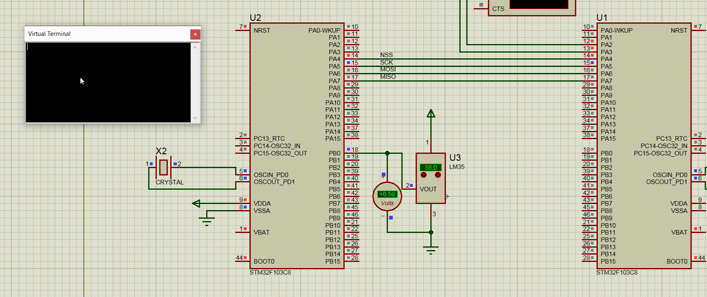

# SPI Master–Slave Temperature Monitor (STM32F103 / Bare-Metal CMSIS)

An educational project demonstrating **SPI communication between two STM32F103 microcontrollers** (Blue Pill family), implemented entirely without the HAL layer. All peripheral registers (SPI, USART, ADC, GPIO) are accessed directly through the CMSIS header (`stm32f103xb.h`) so the real behavior of each peripheral is fully visible and traceable.

## 1. System Overview

```
[PC / Terminal] --UART(9600,8N1)--> [MCU #1: MASTER] --SPI1 (Mode 0)--> [MCU #2: SLAVE] --ADC(CH8/PB0)--> [LM35]
```

1. The user sends the command string `start` over UART2 (9600 baud) to the **Master** board via a serial terminal.
2. The Master parses the command and initiates an SPI transaction as the **Master** device.
3. The **Slave** board continuously samples ambient temperature from an analog **LM35** sensor (connected to PB0 / ADC channel 8).
4. When the Slave receives the command byte `0x01` over SPI, it responds with the most recently measured temperature value.
5. The Master prints the received value over UART in the format `T:<temperature>`.

## 2. Folder Structure (both projects)

```
SPI_Master/ (or SPI_Slave/)
├── Inc/            # Header files (.h) — prototypes and macros
│   ├── main.h
│   ├── spi.h
│   ├── Uart.h
│   └── (adc.h / GPIO.h only in Slave)
└── Src/             # Implementation files (.c)
    ├── main.c        # Main application logic (simple state machine)
    ├── spi.c          # Register-level SPI driver
    ├── Uart.c         # Register-level USART2 driver
    └── (adc.c / GPIO.c only in Slave)
```

This layout follows the common **Driver / Application Separation** pattern: each peripheral (SPI, UART, ADC, GPIO) is an independent module with its own header and source file, while `main.c` only contains the high-level (state-machine) logic. This separation keeps the project readable for learning purposes and maintainable, and aligns with common embedded coding-standard practices (including ST100-style conventions):

- **Every header file uses include guards** (`#ifndef ... #define ... #endif`).
- **Macros are written in UPPER_CASE** with meaningful suffixes (`_EN`, `_FLAG`, `_BIT`, `_MASK`).
- **No magic numbers**: every register bit (`CR1`, `CR2`, `SR`, `CRL`) is mapped to a descriptively named macro before use (e.g. `SSM`, `RXNE_FLAG`, `CPHA`).
- **Single-responsibility functions**: each function performs exactly one task (`SPI1_INIT`, `GPIOA_SPI1_INIT`, `SPI_Transmitt`, …).

## 3. Master Board — Step-by-Step Code Walkthrough

### a) Hardware Initialization
| Module | Function | What it does |
|---|---|---|
| UART2 | `USART2_INIT()` | Enables GPIOA and USART2 clocks, configures PA2=TX (Alt-Function), PA3=RX (Floating Input), sets `BRR=0x0341` for 9600 baud on `APB1=8MHz` |
| SPI1  | `GPIOA_SPI1_INIT()` | PA4=NSS (manual GPIO output), PA5=SCK, PA6=MISO (input), PA7=MOSI (Alt-Function output) |
| SPI1  | `SPI1_INIT()` | **Master** mode, **Mode 0** (`CPOL=0, CPHA=0`), prescaler = `PCLK/4`, **MSB first**, 8-bit data frame, software slave management (`SSM=1, SSI=1`) |

### b) Main Loop Logic (`main.c`)
An infinite loop that reads UART input character by character (`Read_Uasrt`), echoes each character back, and stores it in a `recieved_data[10]` buffer until `\r` or `\n` is received:
- If the received string equals `"start"` → `SPI_Read_Teamprature()` is called and the returned value is printed over UART via `sprintf("T:%d\r\n", Temp)`.
- The buffer and its index (`Row`) are reset for the next command.
- Buffer overflow (more than 9 characters without Enter) is detected and an error message is printed.

### c) SPI Transaction for Reading Temperature (`spi.c`)
```
SPI_Read_Teamprature():
   1. NSS (PA4) is driven low  → transaction starts
   2. Send command byte CMD_READ_TEAMP = 0x01
   3. Send first dummy byte (0x00) and discard the response
   4. Send second dummy byte (0x00) and keep the response as the temperature
   5. Wait for the transfer to complete (BSY flag)
   6. NSS is driven high → transaction ends
```
This "command + dummy byte(s)" pattern is required because SPI is full-duplex: every byte sent also causes a byte to be received simultaneously. The Slave only places valid data into its DR register **one byte after** processing the command, so the Master must send at least one extra byte to "capture" that value.

## 4. Slave Board — Step-by-Step Code Walkthrough

### a) Hardware Initialization
| Module | Function | What it does |
|---|---|---|
| SPI1 | `GPIOA_SPI1_INIT()` | Same PA4–PA7 pin mapping as the Master, but with reversed roles (MISO=output, MOSI=input) |
| SPI1 | `SPI1_INIT()` | **Slave** mode (`MASTER_EN` disabled), Mode 0, 8-bit frame, **hardware NSS management** (`SSM=0`), `RXNE` interrupt enabled and `NVIC_EnableIRQ(SPI1_IRQn)` |
| ADC1 | `adc_PB0_init()` | Enables GPIOB and ADC1 clocks, selects channel 8 (PB0), continuous conversion mode (`CONT`), runs the standard ADC calibration register sequence |

### b) Reading Temperature from the LM35
`adc_read()` returns the raw ADC value (0–4095). In `main.c`:
```c
Temp = adc / 8.22f;   // convert raw ADC reading to degrees Celsius
dama = (int)Temp;      // final value transmitted over SPI
```
The `8.22` scale factor is derived from the LM35's output characteristic (10 mV per °C) combined with the ADC reference voltage, and can be adjusted based on the actual Vref of the board.

### c) Responding to the Master via SPI Interrupt (`SPI1_IRQHandler`)
The Slave operates in an **interrupt-driven** manner (not polling), which is one of the key educational differences compared to the Master:
1. On every received byte, `RXNE_FLAG` is set and the interrupt fires.
2. The received byte is stored in `recieved_data`.
3. If the received byte equals `CMD_READ_TEMP (0x01)` → the value `dama` is immediately loaded into `SPI1->DR` to be transmitted on the **next** transfer to the Master; otherwise `dama` is also reloaded into DR (to cover subsequent dummy bytes sent by the Master).
4. If the Overrun flag (`OVR_FLAG`) is set, it is cleared using the standard procedure (read `DR`, then read `SR`).
5. In `main()`, when `recieved_data == 0x01`, `SPI_Transmitt(dama)` is called, which reloads the same value into DR (temporarily disabling the interrupt to avoid a race condition).

## 5. Pin Mapping Summary

| Pin | Role on Master | Role on Slave |
|---|---|---|
| PA2 | USART2_TX | — |
| PA3 | USART2_RX | — |
| PA4 | SPI1_NSS (output, software-controlled) | SPI1_NSS (input, hardware-controlled) |
| PA5 | SPI1_SCK (output) | SPI1_SCK (input) |
| PA6 | SPI1_MISO (input) | SPI1_MISO (output) |
| PA7 | SPI1_MOSI (output) | SPI1_MOSI (input) |
| PB0 | — | ADC1_IN8 ← LM35 sensor |

## 6. Educational Notes and Technical Remarks

- **SPI is full-duplex**: every transaction sends and receives simultaneously; that's why the Master must send an extra dummy byte to capture a meaningful byte from the Slave.
- **Two different NSS management models**: the Master uses `SSM/SSI` (software) with manual GPIO control, while the Slave relies on hardware `NSS`; this combination is the most common pattern for single-slave SPI on STM32F1.
- **Polling vs. Interrupt**: the Master operates in a blocking/polling fashion using the `TXE`/`RXNE`/`BSY` flags (simple but time-consuming), while the Slave must be event-driven (interrupt-based) since it cannot predict when the Master will start clocking SPI.
- **Original typos preserved**: identifiers such as `Teamprature` (instead of `Temperature`), `recieved`/`Uasrt` (instead of `received`/`Uart`), and `dama` (instead of `data`) are kept as-is to match the original source files; correcting them is recommended in future revisions.
- **Possible extensions**: adding CRC or timeout handling on the SPI line, and validating the received temperature range on the Master side, are good next exercises.

## 7. How to Run

1. Open both projects in **STM32CubeIDE** and flash each one onto a separate STM32F103 board.
2. Wire the SPI pins according to the table above, and connect a **common GND** between the two boards.
3. Connect the LM35 to PB0 on the Slave board, powered at 3.3–5V (3.3V is preferred given the ADC voltage range).
4. Connect the Master's UART2 to a computer via a USB-to-Serial adapter, and open a serial terminal at 9600 baud, 8N1.
5. Send the string `start`; the response will appear as `T:<temperature value>`.
